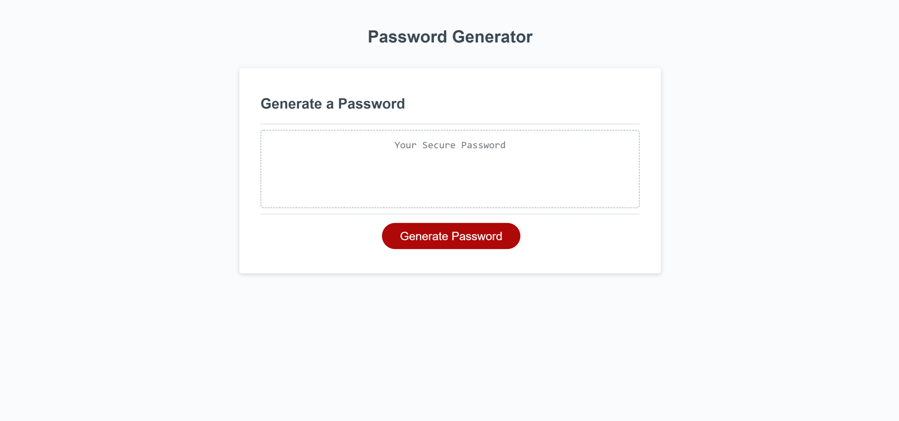

# 2-13-21-Homework
# 03 JavaScript: Password Generator

This is a random password generator. Users can select desired password length and any combination of four possible character sets (lowercase letters, uppercase letters, numbers, and special characters) to include in the password.

You can find the password generator [here](https://elisesamanthadaly.github.io/2-13-21-Homework/).

## Usage

Click the red "Generate Password" button at the center of the screen to begin.

Input a desired password length between 8 and 128, using numeric characters ("8" instead of "eight").

Choose which of the four possible character sets to include in the password. At least one set must be chosen.

The randomized password will replace the text "Your Secure Password."

New passwords can be generated in succession.

## Credits

[MDN Web Docs](https://developer.mozilla.org/en-US/) was referenced extensively for this project.

## License

MIT License

Copyright (c) 2021 Elise Daly

Permission is hereby granted, free of charge, to any person obtaining a copy
of this software and associated documentation files (the "Software"), to deal
in the Software without restriction, including without limitation the rights
to use, copy, modify, merge, publish, distribute, sublicense, and/or sell
copies of the Software, and to permit persons to whom the Software is
furnished to do so, subject to the following conditions:

The above copyright notice and this permission notice shall be included in all
copies or substantial portions of the Software.

THE SOFTWARE IS PROVIDED "AS IS", WITHOUT WARRANTY OF ANY KIND, EXPRESS OR
IMPLIED, INCLUDING BUT NOT LIMITED TO THE WARRANTIES OF MERCHANTABILITY,
FITNESS FOR A PARTICULAR PURPOSE AND NONINFRINGEMENT. IN NO EVENT SHALL THE
AUTHORS OR COPYRIGHT HOLDERS BE LIABLE FOR ANY CLAIM, DAMAGES OR OTHER
LIABILITY, WHETHER IN AN ACTION OF CONTRACT, TORT OR OTHERWISE, ARISING FROM,
OUT OF OR IN CONNECTION WITH THE SOFTWARE OR THE USE OR OTHER DEALINGS IN THE
SOFTWARE.